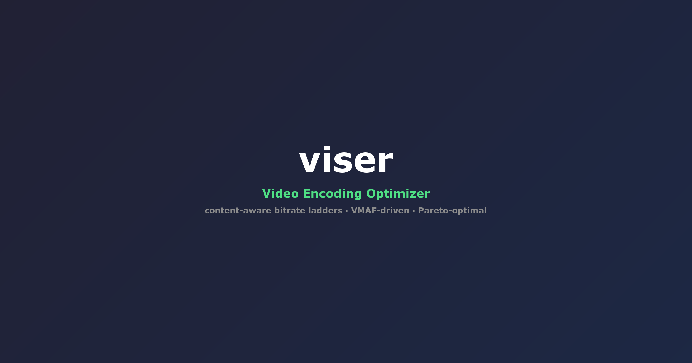

# viser — Video Encoding Optimizer

<p align="center">
  
</p>

**Name:** *Viser* blends *vision* + *optimizer* — it sees the optimal encoding for every video. It's also French *viser* ("to aim/see").

[](https://crates.io/crates/viser-cli)
[](https://docs.rs/viser-cli)
[](https://github.com/vbasky/viser/actions)
[](LICENSE)
[](https://www.rust-lang.org)

**Name:** *Viser* blends *vision* + *optimizer* — it sees the optimal encoding for every video. It's also French *viser* ("to aim/see").

**Acknowledgment:** viser builds on decades of research in rate-distortion theory,
perceptual quality measurement, and content-adaptive streaming. Thank you to the
engineers and researchers at Netflix, Beamr, Fraunhofer, Mux, and the broader
video encoding community whose published work, open-source tools, and
foundational science inform every part of this project.

---

viser analyzes video content and computes optimal encoding parameters using
perceptual quality measurement (VMAF) and convex hull (Pareto frontier) analysis.
Instead of applying a one-size-fits-all bitrate ladder, viser tailors encoding
decisions to each video's content complexity, producing better quality at lower
bitrates.

| Content Type | Fixed Ladder @ 3 Mbps 1080p | viser Custom Ladder |
|---|---|---|
| Talking head (news anchor) | Excellent — bits wasted | Same quality, half the bitrate |
| Animation (Pixar-style) | Very good — some waste | Same quality, ~30% less bitrate |
| Sports (football game) | Acceptable — needs more | Same bitrate, higher quality |
| Film grain (dark thriller) | Poor — severely underbit | Same bitrate, transparent quality |

## Optimization Methods

| Method | Granularity | Best For | Description |
|--------|-------------|----------|-------------|
| [Per-Title](docs/per-title-encoding.md) | Whole video | VOD catalogs | Computes a custom bitrate ladder per video using convex hull analysis across resolutions, codecs, and quality levels |
| [Per-Shot](docs/per-shot-encoding.md) | Shot (2-30s) | Feature films, episodic | Detects scene boundaries and allocates bits across shots using Trellis optimization — complex scenes get more bits, simple get fewer |
| [Segment-Level CRF](docs/segment-level-adaptation.md) | 1-second segments | Variable complexity content | Adapts CRF per segment with closed-loop VMAF verification to maintain consistent quality |
| [Context-Aware](docs/content-adaptive-encoding.md) | Per device class | Multi-device streaming | Generates device-specific ladders (mobile/desktop/TV) with resolution caps, codecs, and VMAF models |

## Architecture

```
viser/
├── crates/
│   ├── viser-ffmpeg/         FFmpeg/FFprobe wrapper (encode, probe, path, cache)
│   ├── viser-quality/        VMAF/PSNR/SSIM measurement
│   ├── viser-hull/           Convex hull (Pareto frontier) + BD-Rate
│   ├── viser-ladder/         Ladder selection with crossover enforcement
│   ├── viser-shot/           Shot/scene detection (FFmpeg scdet)
│   ├── viser-complexity/     Spatial/temporal/DCT complexity analysis
│   ├── viser-encoding/       Shared config, preset mapping, temp cleanup
│   ├── viser-pertitle/       Per-title analysis pipeline
│   ├── viser-pershot/        Per-shot + Trellis optimization
│   ├── viser-persegment/     Segment-level CRF adaptation
│   ├── viser-contextaware/   Device-specific ladder generation
│   ├── viser-checkpoint/     Resume support for long analyses
│   ├── viser-compare/        Browser-based comparison player
│   ├── viser-chart/          Chart generation (plotters)
│   └── viser-cli/            CLI binary (clap)
├── docs/                     Principles and science docs
├── Cargo.toml
├── LICENSE
└── rustfmt.toml
```

## Quick Start

### Prerequisites

- **Rust 1.85+** (edition 2024) — install via [rustup](https://rustup.rs/)
- **FFmpeg with libvmaf** — build from source or use a package manager
- FFmpeg/FFprobe must be on `PATH`, or set `VISER_FFMPEG` / `VISER_FFPROBE` env vars

```bash
# Build viser
cargo build --release

# Run your first per-title analysis
./target/release/viser per-title analyze -i video.y4m \
  --resolutions 240p --codecs libx264 --preset ultrafast
```

## Usage

```bash
# Per-title analysis
viser per-title analyze -i video.y4m \
  --codecs libx264,libsvtav1 \
  --resolutions 480p,720p,1080p \
  --parallel 4 -o results.json

# Per-shot analysis
viser per-shot detect -i video.y4m --threshold 10
viser per-shot analyze -i video.y4m --target-bitrate 2000

# Segment-level CRF adaptation
viser per-segment analyze -i video.y4m --target-vmaf 93 --codec libx264

# Context-aware encoding
viser context-aware analyze -i video.y4m --devices mobile,desktop,tv

# Visual QA with comparison player
viser quality measure --reference original.mp4 --distorted encoded.mp4 \
  --per-frame -o vmaf_data.json
viser compare --reference original.mp4 --encoded encoded.mp4 \
  --vmaf-data vmaf_data.json

# Other commands
viser inspect probe video.mp4
viser encode input.y4m -o out.mp4
viser quality measure --reference a --distorted b
```

## Supported Codecs

| Codec | Flag | Notes |
|-------|------|-------|
| H.264/AVC | `libx264` | Fastest encode, widest device support |
| H.265/HEVC | `libx265` | ~30-40% better compression than H.264 |
| AV1 | `libsvtav1` | ~50% better compression, royalty-free, SVT-AV1 4.0 |

## Design

| Principle | Description |
|-----------|-------------|
| **Content-aware** | Tailors encoding to each video's visual complexity, not one-size-fits-all |
| **VMAF-driven** | Uses perceptual quality scores that correlate with human eyes, not PSNR |
| **Pareto-optimal** | Finds the set of encoding points where no improvement is possible without tradeoff |
| **Four granularities** | Whole-video, per-scene, per-second, per-device — pick the right level |
| **Async + parallel** | tokio-based concurrent trial encodes, semaphore-controlled parallelism |
| **Resumable** | SHA-256 checkpointing means multi-hour analyses survive crashes |
| **BSD-2-Clause** | Permissive license, no patent grant implications |

## Project Scale

| Metric | Value |
|--------|-------|
| Workspace crates | 15 |
| Optimization methods | 4 (per-title, per-shot, per-segment, context-aware) |
| Codecs | 3 (H.264, H.265, AV1) |
| Quality metrics | 3 (VMAF, PSNR, SSIM) |
| License | BSD-2-Clause |
| MSRV | 1.85 |

## Status

All four optimization methods ported from the prior Go implementation.

- **Per-Title** — Convex hull, BD-Rate, resolution crossover enforcement, Netflix/Apple fixed ladder comparison, CRF and QP trial modes, checkpointing.
- **Per-Shot** — Shot detection (scdet), per-shot hulls, Trellis Lagrangian bit allocation.
- **Segment-Level CRF** — Complexity analysis (entropy + YDIF + DCT energy), binary-search CRF per 1-second segment, closed-loop VMAF verification.
- **Context-Aware** — Device profiles (mobile/desktop/TV/4K TV) with resolution caps, codec preferences, VMAF model selection.

### Backlog
- Chart generation (plotters integration — not yet wired into CLI)
- Chunked encoding
- ML feature extraction and prediction
- REST API
- Comprehensive test suite

## Documentation

| Document | Description |
|----------|-------------|
| [Per-Title Encoding](docs/per-title-encoding.md) | Convex hull, R-D optimization, ladder selection |
| [Per-Shot Encoding](docs/per-shot-encoding.md) | Shot detection, Trellis, constant-slope bit allocation |
| [Content-Adaptive Encoding](docs/content-adaptive-encoding.md) | Device profiles, multi-codec hulls |
| [Segment-Level CRF](docs/segment-level-adaptation.md) | CRF tuning with complexity analysis |
| [Quality Metrics](docs/quality-metrics.md) | VMAF, PSNR, SSIM, BD-Rate |
| [Rate Control](docs/rate-control.md) | CRF vs QP vs VBR |
| [Shot Detection](docs/shot-detection.md) | scdet, PySceneDetect, TransNetV2 |
| [Chunked Encoding](docs/chunked-encoding.md) | Parallel encoding for production |
| [Comparison Player](docs/comparison-player.md) | Side-by-side QA with VMAF timeline |

## License

BSD 2-Clause License — see [LICENSE](LICENSE) for details.

H.264/HEVC encoding may require patent licenses depending on use case.
AV1 is royalty-free. See [NOTICE](NOTICE) for third-party attributions.
