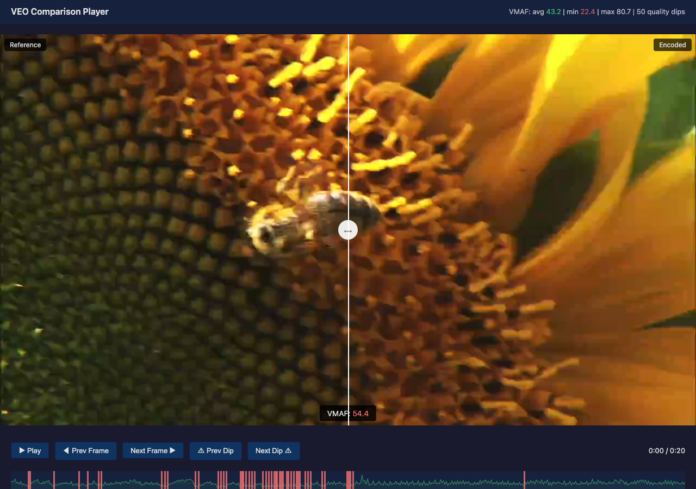
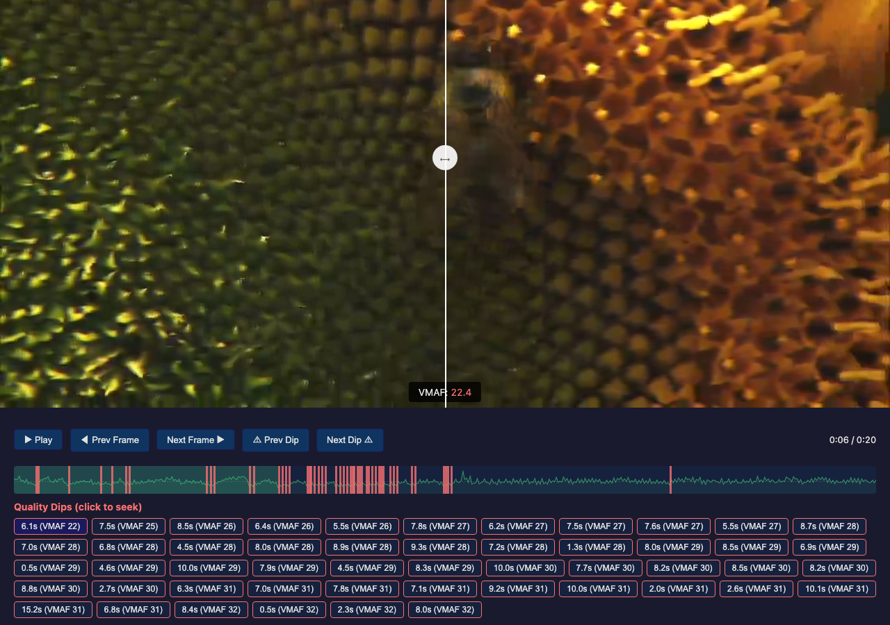

# Comparison Player

VEO includes a browser-based side-by-side video comparison player for visual
QA of encoding results. It displays the reference and encoded video with a
draggable slider, per-frame VMAF overlay, and quality dip markers for quickly
finding problem areas.

## Screenshots

### Overview - sunflower 1080p encoded at CRF 38 (720p)



Drag the slider left or right to reveal more of the reference (left) or
encoded (right) video. This makes it easy to compare quality at any point
in the frame - drag left to see mostly the encoded version and spot
artifacts, drag right to see the clean reference. The VMAF overlay shows
the current frame's quality score, and the timeline at the bottom displays
the per-frame VMAF graph with dip markers.

### Seeking to a quality dip



Clicked a dip marker - the player seeks to a frame where VMAF drops
significantly. Compression artifacts are clearly visible on the encoded side
(right). Dip buttons below the timeline list all detected quality drops.
Drag the slider to reveal more of either side.

## Test Content

The sunflower clip (`sunflower_1080p25.y4m`) from the Xiph/Derf collection
is ideal for testing the comparison player - it has high spatial complexity
(fine sunflower texture) that reveals compression artifacts clearly at
lower bitrates. Download it with:

```bash
./scripts/download-assets.sh --clip sunflower
```

## When to Use

The comparison player is the final step in encoding optimization - after
the numbers look good, verify they look good to human eyes:

- **Validate artifacts at ladder rungs** - does CRF 30 at 720p actually look acceptable?
- **Check resolution crossovers** - is 720p really better than 480p at 1000 kbps?
- **Compare codecs visually** - where does AV1 win over H.264?
- **QA before publishing** - scrub through the lowest rung to ensure it's not embarrassing

## Example Workflow

Using the sunflower test clip (high spatial complexity, reveals artifacts well):

```bash
# Download the test clip
./scripts/download-assets.sh --clip sunflower

# Step 1: Encode at a target quality (CRF 38 to see visible artifacts)
veo encode assets/hd/sunflower_1080p25.y4m \
  -o sunflower_encoded.mp4 \
  --codec libx264 --crf 38 --preset veryfast \
  --width 1280 --height 720

# Step 2: Create a browser-playable reference (Y4M won't play in browser)
veo encode assets/hd/sunflower_1080p25.y4m \
  -o sunflower_reference.mp4 \
  --codec libx264 --crf 10 --preset veryfast \
  --width 1280 --height 720

# Step 3: Measure per-frame VMAF and save to JSON
veo quality measure \
  --reference sunflower_reference.mp4 \
  --distorted sunflower_encoded.mp4 \
  --per-frame \
  -o sunflower_vmaf.json

# Step 4: Launch the comparison player
veo compare \
  --reference sunflower_reference.mp4 \
  --encoded sunflower_encoded.mp4 \
  --vmaf-data sunflower_vmaf.json
```

The browser opens automatically showing the sunflower with the bee - drag
the slider to compare the crisp reference against the compressed version,
and click dip markers to jump to the worst frames.

### Using with per-title analysis output

```bash
# Run per-title analysis with final encodes
veo per-title analyze -i movie.mp4 \
  --codecs libx264,libsvtav1 \
  --resolutions 480p,720p,1080p \
  --encode-output ./rungs/

# Measure per-frame VMAF for a specific rung
veo quality measure \
  --reference movie.mp4 \
  --distorted ./rungs/rung3_720p_libsvtav1_1500kbps.mp4 \
  --per-frame \
  -o ./rungs/rung3_vmaf.json

# Launch comparison player for that rung
veo compare \
  --reference movie.mp4 \
  --encoded ./rungs/rung3_720p_libsvtav1_1500kbps.mp4 \
  --vmaf-data ./rungs/rung3_vmaf.json
```

## Flags

### `veo quality measure`

| Flag | Description |
|------|-------------|
| `--reference` | Original source video |
| `--distorted` | Encoded video to measure |
| `--per-frame` | **Required for comparison player.** Measures VMAF for every frame (slower than default subsampled mode) |
| `-o / --output` | **Required for comparison player.** Saves per-frame results as JSON |
| `--subsample` | Frame subsampling (default 0 = every frame when `--per-frame` is set) |

### `veo compare`

| Flag | Description |
|------|-------------|
| `--reference` | Reference video file (must be browser-playable, e.g., MP4/H.264) |
| `--encoded` | Encoded video file |
| `--vmaf-data` | Per-frame VMAF JSON from `veo quality measure --per-frame -o` |
| `--port` | HTTP port (default 8787) |

**Note:** The reference video must be in a browser-playable format (MP4 with
H.264/H.265/AV1). If your source is Y4M or another raw format, first encode
a high-quality reference:

```bash
veo encode source.y4m -o reference.mp4 --codec libx264 --crf 10
```

## Player Features

### Side-by-Side Comparison
- Drag the slider left/right to compare reference vs encoded
- Reference on the left, encoded on the right
- Labels show which side is which

### VMAF Overlay
- Current frame's VMAF score displayed at the bottom center
- Color-coded: green (90+), yellow (70-90), red (<70)
- Updates in real-time during playback

### Quality Timeline
- VMAF graph drawn across the full timeline
- Dashed horizontal line shows the average VMAF
- Green fill shows quality level over time
- Click anywhere on the timeline to seek

### Quality Dip Markers
- Yellow markers: frames where VMAF drops 5+ points below average
- Red markers: frames where VMAF drops 10+ points below average
- Hover for tooltip showing exact VMAF and timestamp
- Click to seek directly to the dip
- Clickable buttons below the timeline list all dips

### Keyboard Shortcuts

| Key | Action |
|-----|--------|
| Space | Play / Pause |
| Left Arrow | Step back 1 frame |
| Right Arrow | Step forward 1 frame |
| `[` | Jump to previous quality dip |
| `]` | Jump to next quality dip |

## Typical QA Process

1. **Start with the timeline** - scan the VMAF graph for dips (red/yellow markers)
2. **Click the worst dip** - seek to the lowest VMAF frame
3. **Drag the slider** - compare reference vs encoded at that frame
4. **Step frame-by-frame** - use arrow keys to see if the artifact is a single frame or sustained
5. **Assess severity** - is the artifact visible at normal playback speed?
6. **Check other rungs** - repeat for the lowest and highest quality rungs

If dips are unacceptable, consider:
- Lowering CRF for that bitrate tier
- Using a slower preset for better quality
- Switching codecs (AV1 often handles problem content better than H.264)
- Running segment-level CRF adaptation (`veo per-segment analyze`) to target a specific VMAF
