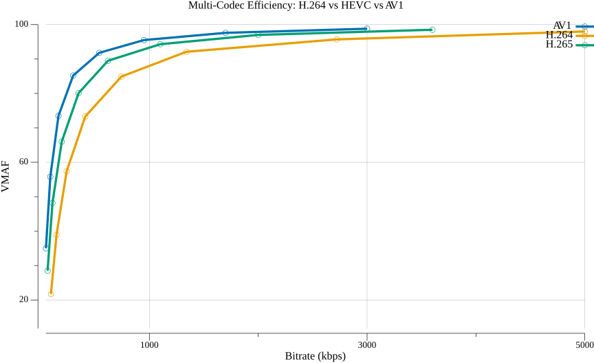
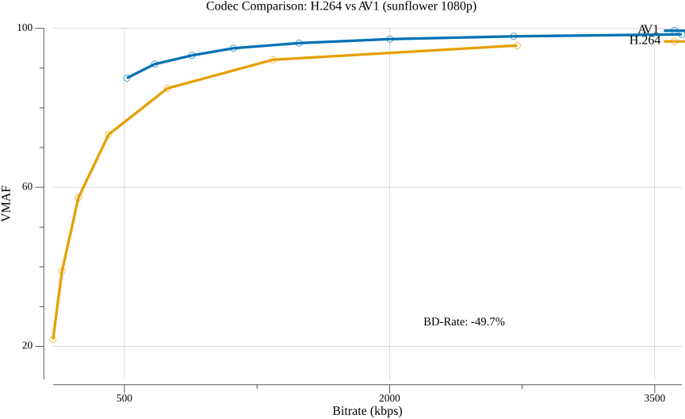
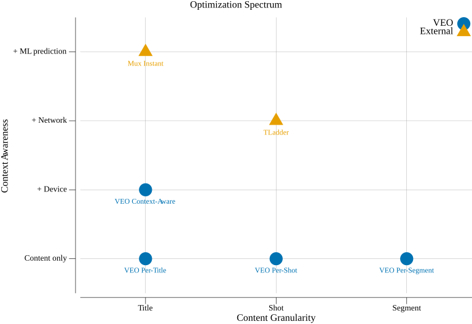

# Content-Adaptive Encoding (CAE)

Content-Adaptive Encoding is the broadest category of optimization, encompassing
any technique that tailors encoding decisions to the content, the viewer's
context, or both. Per-title and per-shot encoding are specific instances of CAE.
This document covers the additional dimensions: device awareness, network
adaptation, multi-codec optimization, and ML-driven prediction.

This is VEO's fourth optimization goal, building on all prior foundations.

## Beyond Content Complexity

Per-title and per-shot optimization answer: "what encoding parameters are optimal
for **this content**?" Context-aware encoding extends the question: "what
parameters are optimal for **this content, viewed on this device, over this
network**?"

```
                    Content Complexity
                         │
                         ▼
              ┌────────────────────────┐
              │                        │
  Device ────►│   Encoding Decision    │◄──── Network
  Context     │                        │      Conditions
              │   (resolution,         │
              │    bitrate,            │
              │    codec,              │
              │    quality target)     │
              └────────────────────────┘
```

## Device-Aware Encoding

### The Insight

A viewer watching on a 5-inch phone cannot perceive the same level of detail as a
viewer on a 65-inch 4K TV. Sending 4K at 15 Mbps to a phone wastes bandwidth;
sending 720p at 2 Mbps to a TV wastes the display's capabilities.

### VMAF Phone Model

Netflix's VMAF includes a **phone model** that accounts for smaller screen size
and typical viewing distance:

```
Standard VMAF:  calibrated for TV at 3H viewing distance
Phone VMAF:     calibrated for mobile at ~1H viewing distance
4K VMAF:        calibrated for 4K TV at 1.5H viewing distance
```

The phone model produces higher scores for the same encode because small-screen
viewing is more forgiving. This means:

- A 720p encode at 1.5 Mbps might score VMAF 85 (standard) but VMAF 93 (phone)
- The phone viewer gets "transparent" quality at 1.5 Mbps
- The TV viewer needs 4 Mbps for the same perceived quality

### Device-Specific Ladders

Rather than one ladder for all devices, context-aware encoding produces multiple
ladders:

```
Mobile ladder:        TV ladder:           4K TV ladder:
360p @  200 kbps     480p @  800 kbps     720p  @ 2000 kbps
480p @  500 kbps     720p @ 1500 kbps     1080p @ 4000 kbps
720p @ 1200 kbps     1080p@ 3000 kbps     1440p @ 6000 kbps
720p @ 2000 kbps     1080p@ 5000 kbps     2160p @ 10000 kbps
                     1080p@ 8000 kbps     2160p @ 15000 kbps
```

The mobile ladder tops out at 720p because phones can't display higher
resolution meaningfully. The 4K TV ladder starts at 720p because anything lower
looks poor on a large screen.

## Multi-Codec Optimization

### The Problem

Different codecs have different efficiency profiles:



AV1 achieves the same quality at ~50% less bitrate than H.264, with HEVC
falling in between. But not all devices support AV1 - legacy devices may only
support H.264.

### Cross-Codec Hulls

Multi-codec optimization computes convex hulls across codecs and selects the
**best codec per operating point**:



The chart shows AV1 consistently achieving higher VMAF at the same bitrate
compared to H.264. The BD-Rate of -49.7% means AV1 needs roughly half the
bitrate for the same quality. The cross-codec hull selects AV1 at most
bitrate tiers, with H.264 only at the lowest quality rungs where AV1's
minimum bitrate is still too high.

### YouTube's View-Count Tiering

YouTube implements a practical variant: codec selection based on content
popularity rather than per-rung optimization:

| View Count | Codecs Produced |
|-----------|----------------|
| < 3,000 | H.264 only |
| > 3,500 | + VP9 |
| > 34 million | + AV1 |

The economic logic: expensive AV1 encodes are only justified when CDN savings
from many viewers exceed the encoding cost.

## ML-Predicted Encoding

### The Cost Problem

Per-title encoding requires exhaustive trial encodes:
- 5 resolutions × 9 CRF values × 3 codecs = 135 encodes per title
- Each encode must be quality-measured (VMAF)
- Total processing: hours per title

ML prediction eliminates trial encodes by predicting the convex hull directly
from content features.

### Feature Extraction

Content complexity features that predict encoding behavior:

**Spatial features** (per-frame):
- SI (Spatial Information): edge energy via Sobel filtering
- GLCM (Gray-Level Co-occurrence Matrix): texture statistics
- DCT energy: frequency domain complexity (used by VCA)

**Temporal features** (across frames):
- TI (Temporal Information): pixel differences between frames
- Motion vectors: from a fast pre-encode or optical flow
- Scene change frequency

**Combined features**:
- Average and variance of spatial/temporal features across frames
- Distribution statistics (percentiles, skewness)

### Prediction Models

The 2025 ACM TOMM benchmark paper compared multiple approaches:

| Approach | Features | Model | Accuracy | Extraction Time |
|----------|----------|-------|----------|-----------------|
| VoD-HandC | GLCM + temporal coherence | ExtraTrees Regressor | **88%** | 145 sec/UHD |
| Live-HandC | VCA DCT energy | ExtraTrees | 82% | <1.1 sec |
| DNN | VGG16/ResNet-50 + pooling | Neural network | 85% | Variable |

**Key finding**: ExtraTrees with handcrafted features **outperforms deep learning**
for this task. The simpler model generalizes better, likely because the training
datasets are small relative to the DNN capacity.

### The Prediction Pipeline

```
Source Video
       │
       ▼
┌───────────────────┐
│ Feature           │  Extract SI, TI, GLCM, DCT energy
│ Extraction        │  (~2 minutes for a feature film)
└─────────┬─────────┘
          │
          ▼
┌───────────────────┐
│ ML Model          │  ExtraTrees predicts (bitrate, VMAF) at each
│ Prediction        │  (resolution, CRF) - ~milliseconds
└─────────┬─────────┘
          │
          ▼
┌───────────────────┐
│ Hull +            │  Standard hull computation and ladder selection
│ Ladder            │  on predicted points
└───────────────────┘
```

**Result**: Per-title optimization in seconds instead of hours, with only 1.77%
quality loss vs. exhaustive encoding (per the ACM TOMM benchmark).

### Mux's "Instant Per-Title"

The leading commercial implementation. Claims:
- 30% smaller files vs. fixed ladder
- 15% quality improvement
- 20x cheaper than exhaustive per-title
- Prediction in milliseconds

## Network-Aware Optimization

### ABR Player Feedback

Traditional encoding optimization is one-directional: encode → deliver → hope
for the best. Network-aware encoding closes the loop:

```
Encoding          CDN           Player          Viewer
Pipeline ───────► Delivery ────► Playback ──────► Experience
    ▲                              │
    │                              │
    └──────── Telemetry ◄──────────┘
              (rebuffering, quality switches,
               startup time, viewing duration)
```

### TLadder (2025)

A recent research direction: **QoE-centric optimization using real playback
feedback at billion scale**. Rather than optimizing purely for VMAF, TLadder
incorporates:

- Actual rebuffering rates per title per network condition
- Quality switching frequency and magnitude
- Startup delay
- Viewer engagement (do they stop watching?)

This represents a shift from content-driven optimization to experience-driven
optimization. The encoding ladder is tuned not just for visual quality but for
the holistic viewer experience including network delivery.

## ARTEMIS (Live Streaming)

Adaptive Bitrate Ladder Optimization for Live Video Streaming (NSDI 2024):

- Optimizes encoding ladders in **real-time** for live content
- Adapts ladder as content complexity changes (e.g., sports: action → replay → commentary)
- Considers both content features and current network conditions
- Cannot use trial encodes (no time) - relies on lightweight ML prediction

## The Full Picture

All optimization approaches can be viewed as points on a spectrum of
granularity and context:



VEO's four methods (blue) progress from left to right (content granularity)
and bottom to top (context awareness). External systems like TLadder
(network-aware) and Mux Instant (ML-predicted) occupy higher context
dimensions that VEO does not yet implement.

## Further Reading

- [Convex Hull Prediction Methods for Bitrate Ladder Construction (ACM TOMM, 2025)](https://dl.acm.org/doi/10.1145/3723006)
- [ARTEMIS: Adaptive Bitrate Ladder for Live Streaming (NSDI 2024)](https://www.usenix.org/system/files/nsdi24-tashtarian.pdf)
- [Mux: Instant Per-Title Encoding](https://www.mux.com/blog/instant-per-title-encoding)
- Netflix: [Performance Comparison of Video Coding Standards](https://netflixtechblog.com/performance-comparison-of-video-coding-standards-an-adaptive-streaming-perspective-d45d0183ca95)
