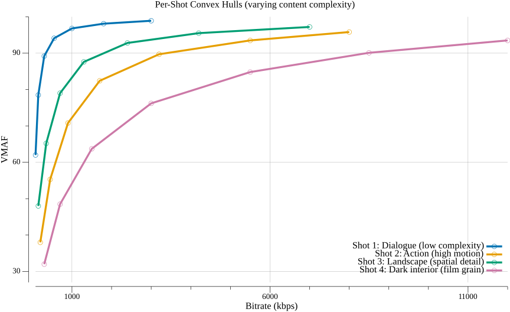
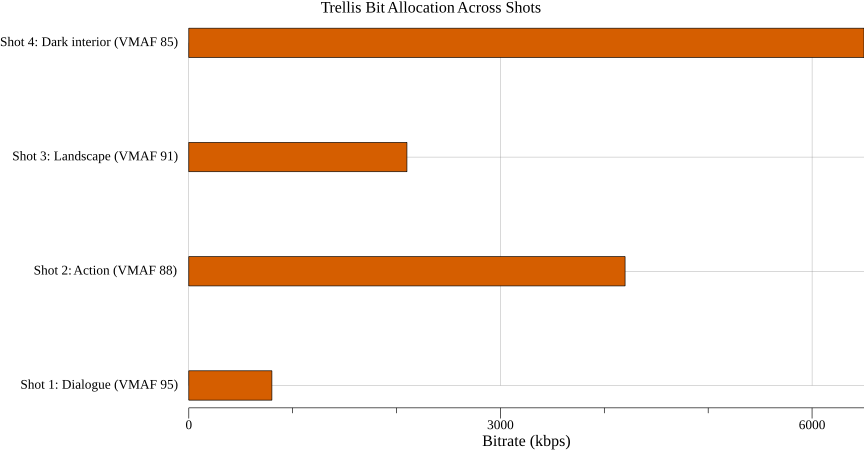

# Per-Shot Encoding

Per-shot encoding extends per-title optimization to **shot-level granularity**.
Instead of one ladder per video, each shot (a continuous sequence from a single
camera setup) gets its own optimal encoding parameters, and bits are allocated
across shots using Trellis optimization.

This is VEO's second optimization goal, building on the per-title foundation.

## Why Shots?

A single video title contains scenes of wildly different complexity. A 2-hour
movie might include:

- Static dialogue scenes (low complexity, needs few bits)
- Action sequences (high motion, needs many bits)
- Establishing shots of landscapes (high spatial detail)
- Dark interior scenes with film grain (extremely expensive to encode)

A per-title ladder uses a single compromise for the entire video. Per-shot
encoding allocates bits **where they're needed** - more bits to complex shots,
fewer to simple ones - while maintaining the same total bitrate.

### Why Shots and Not Scenes or GOPs?

**Shots** are the natural unit because:

1. Frames within a shot are visually similar and respond similarly to encoding
2. Changing parameters at shot boundaries is **perceptually invisible** - viewers
   expect visual discontinuity at cuts
3. Shots are more principled than arbitrary fixed-duration chunks (2-second
   segments) or GOPs
4. Shot boundaries are detectable with high accuracy (PySceneDetect, TransNetV2)

## The Pipeline

```
Source Video
       │
       ▼
┌────────────────┐
│ Shot Detection │  Segment video at scene boundaries
└───────┬────────┘
        │
        ▼
┌────────────────┐
│ Per-Shot       │  Compute independent convex hull for each shot
│ Hull Analysis  │  (same as per-title, but per shot)
└───────┬────────┘
        │
        ▼
┌────────────────┐
│ Trellis        │  Allocate bits across shots using
│ Optimization   │  constant-slope Lagrangian optimization
└───────┬────────┘
        │
        ▼
┌────────────────┐
│ Encode &       │  Encode each shot at its assigned parameters
│ Stitch         │  Concatenate into final stream
└────────────────┘
```

## Shot Detection

### Methods

**Threshold-based (PySceneDetect):**
- ContentDetector: weighted average of HSV pixel changes between frames
- AdaptiveDetector: rolling average threshold that adapts to content
- Detects hard cuts reliably; struggles with gradual transitions (dissolves, fades)

**Deep learning (TransNetV2):**
- 3D separable convolutions for temporal pattern recognition
- Handles both hard cuts and gradual transitions
- Higher accuracy but more compute

**FFmpeg built-in:**
- `select='gt(scene,0.4)'`: scene change probability per frame (0-1)
- `scdet` filter: richer metadata including scene score

### Output

A list of shot boundaries with timestamps:

```
Shot 1:  0.000s - 4.521s   (dialogue, low complexity)
Shot 2:  4.521s - 8.103s   (action, high complexity)
Shot 3:  8.103s - 15.876s  (landscape, medium complexity)
Shot 4: 15.876s - 22.440s  (dark interior, very high complexity)
...
```

## Per-Shot Convex Hull

Each shot gets its own convex hull, computed independently:



The dialogue shot achieves VMAF 95+ at 1 Mbps. The dark interior shot needs 6 Mbps
for the same quality. Their convex hulls have very different shapes - the dialogue
curve rises steeply and flattens early, while the dark interior curve is much
shallower, requiring 10x the bitrate to approach the same quality.

## Trellis Optimization (Bit Allocation)

The key challenge: given a total bitrate budget and per-shot convex hulls, how do
you allocate bits across shots to **maximize overall quality**?

### The Constant-Slope Principle

The optimal allocation follows from Lagrangian optimization. At the optimum, the
**marginal cost of quality improvement** must be equal across all shots.

Formally, if we define the R-D function for shot k as Qₖ(Rₖ) (quality as a
function of bitrate), the optimal allocation {R₁*, R₂*, ..., Rₙ*} satisfies:

```
dQₖ/dRₖ = λ    for all k

subject to: Σ Rₖ · Dₖ = R_total
            (where Dₖ is the duration of shot k)
```

The constant λ is the Lagrange multiplier - the "price" of one unit of bitrate.
At the optimum, every shot has the same slope on its R-D curve. If one shot had
a steeper slope, you could improve total quality by moving bits there from a
shot with a shallower slope.

### Intuition

Think of it like watering plants:

- Each plant (shot) has a growth curve - more water (bits) means more growth
  (quality), but with diminishing returns
- The optimal strategy is to water each plant until the **marginal benefit per
  drop** is equal across all plants
- A plant that's already well-watered (simple shot at high quality) gets fewer
  additional drops
- A thirsty plant (complex shot) gets more

### Trellis Structure

Netflix implements this via a **Trellis algorithm** that finds the globally
optimal assignment:

```
Shot 1 (dialogue) Shot 2 (action)   Shot 3 (landscape) Shot 4 (dark)
┌──────┐          ┌──────┐          ┌──────┐          ┌──────┐
│ 480p │──────────│ 480p │──────────│ 480p │──────────│ 480p │
│CRF 38│          │CRF 28│          │CRF 32│          │CRF 24│
├──────┤          ├──────┤          ├──────┤          ├──────┤
│ 720p │──────────│ 720p │──────────│ 720p │──────────│ 720p │
│CRF 32│          │CRF 22│          │CRF 26│          │CRF 20│
├──────┤          ├──────┤          ├──────┤          ├──────┤
│1080p │──────────│1080p │──────────│1080p │──────────│1080p │
│CRF 26│          │CRF 18│          │CRF 22│          │CRF 16│
└──────┘          └──────┘          └──────┘          └──────┘

Each node = one operating point from that shot's convex hull
  (CRF varies by complexity: dialogue needs fewer bits than action)
Each edge = transition cost (switching resolution between shots)
Optimal path = globally optimal bit allocation under total budget
```

The Trellis finds the path through the graph that maximizes total quality while
respecting the total bitrate budget. The Viterbi algorithm or dynamic programming
solves this efficiently.

### Allocation Result

The output of Trellis optimization is a per-shot bitrate allocation that reflects
content complexity:



The dark interior shot gets 8x the bitrate of the dialogue shot, yet still achieves
lower VMAF - this is the correct behavior. The constant-slope principle ensures
the marginal quality gain per bit is equalized across all shots.

## Stitching

After encoding each shot at its assigned parameters, the shots must be
concatenated into a coherent stream:

1. Force IDR (keyframe) at every shot boundary
2. Ensure GOP alignment across all quality rungs
3. Concatenate shots per rung into the final rendition
4. Generate DASH/HLS manifests with segment boundaries at shot boundaries

### Challenges

- **Segment alignment**: ABR streaming requires aligned keyframes across rungs.
  Shot boundaries may not align with standard 2-second segments.
- **Resolution switching**: If adjacent shots use different resolutions at the
  same rung, the player must handle resolution changes mid-stream.
- **Ad insertion**: Server-Side Ad Insertion (SSAI) is much harder with
  per-shot parameters because ad break points may not align with shot boundaries.

## Results

Netflix's per-shot Dynamic Optimizer achieves significant improvements over
per-title encoding:

| Codec | Bitrate Reduction vs Fixed Ladder |
|-------|----------------------------------|
| x264 (H.264) | ~28% |
| VP9 | ~38% |
| x265 (HEVC) | ~34% |
| AV1 | ~30% (on top of codec gains) |

The improvement over per-title is typically 5-10% additional savings, with the
biggest gains on videos with high complexity variation between shots (e.g., a
movie with both quiet dialogue and intense action).

## Compute Cost

Per-shot encoding is significantly more expensive than per-title:

```
Per-title:  R resolutions × C CRF values × K codecs = N encodes
Per-shot:   N encodes × S shots

Example: 5 × 9 × 3 = 135 per-title encodes
         135 × 200 shots = 27,000 per-shot encodes (for a feature film)
```

However, per-shot encodes are much shorter (individual shots, typically 2-10
seconds), so the total compute is roughly proportional to the total video
duration times the number of operating points tested.

The per-shot approach is embarrassingly parallel along two dimensions:
1. Different (resolution, CRF) combos for the same shot are independent
2. Different shots are independent

This makes cloud-based parallel execution very efficient.

## Further Reading

- Netflix: [Optimized Shot-Based Encodes: Now Streaming!](https://netflixtechblog.com/optimized-shot-based-encodes-now-streaming-4b9464204830)
- Netflix: [Dynamic Optimizer Framework](https://netflixtechblog.com/dynamic-optimizer-a-perceptual-video-encoding-optimization-framework-e19f1e3a277f)
- Streaming Media: [The Case for Shot-Based Encoding](https://www.streamingmedia.com/Articles/Editorial/Short-Cuts/The-Case-for-Shot-Based-Encoding-145473.aspx)
