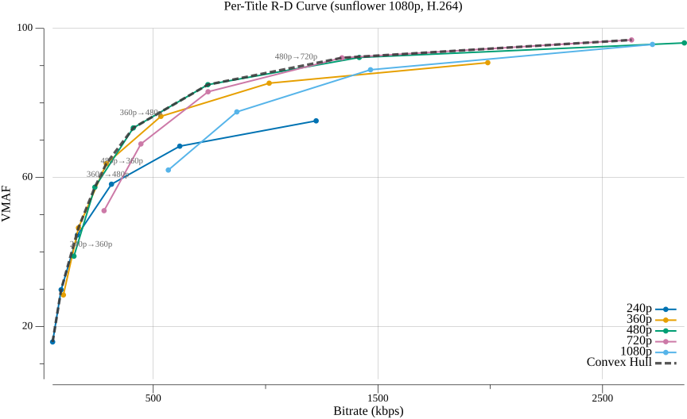
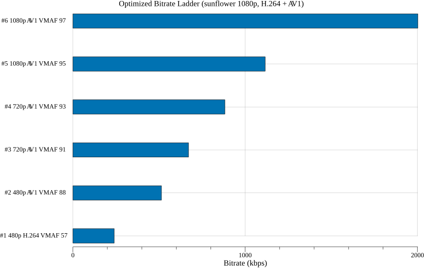

# Per-Title Encoding

Per-title encoding computes an **optimal bitrate ladder tailored to each video
title's content complexity**. Instead of using a fixed set of resolution/bitrate
pairs for all content, it analyzes each title and selects the encoding parameters
that maximize quality per bit.

This is VEO's first and foundational optimization goal.

## The Problem: Fixed Bitrate Ladders

Traditional streaming services use a single bitrate ladder for all content.
Apple's original 2010 HLS recommendation defined 10 rungs from 64 kbps
(audio-only) up to 8564 kbps at 1080p.

This is wasteful because content varies enormously in encoding complexity:

| Content | At 3 Mbps, 1080p |
|---------|------------------|
| Talking head (news anchor) | Excellent quality - bits are wasted |
| Animation (Pixar-style) | Very good quality - some bits wasted |
| Sports (football game) | Acceptable - could use more bits |
| Film grain (dark thriller) | Poor - severely underbitrated |

A fixed ladder either wastes bandwidth on simple content or delivers poor quality
on complex content. Per-title encoding eliminates this tradeoff.

## Core Concept: Rate-Distortion Optimization

Every encoding configuration - a specific (resolution, CRF, codec) combination  - 
maps to a point in two-dimensional **rate-distortion (R-D) space**:



Each resolution traces a curve: as you increase bitrate (lower CRF), quality
improves along a curve of diminishing returns. The curves for different
resolutions cross over - at low bitrates, 480p may look better than 720p because
720p would be too heavily quantized.

## The Convex Hull

The **convex hull** (Pareto frontier) of all R-D points is the set where **no
other configuration achieves better quality at the same or lower bitrate**. Points
on the hull are Pareto-optimal; points below it are dominated (there exists a
better option).

The dashed line in the R-D curve above shows the convex hull - notice how it
traces the upper boundary of all encoding points, selecting the best
resolution at each bitrate range.

### Mathematical Definition

Given a set of encoding results P = {(bᵢ, qᵢ)} where bᵢ is bitrate and qᵢ is
quality (VMAF), the upper convex hull is the subset H ⊆ P such that for every
point (b, q) ∈ H, there is no convex combination of other points that achieves
quality ≥ q at bitrate ≤ b.

Equivalently, H contains all points that lie on the upper boundary of the convex
hull of P in (bitrate, quality) space.

### Algorithm: Andrew's Monotone Chain

VEO computes the upper convex hull using Andrew's monotone chain algorithm,
adapted for our R-D optimization context:

1. Sort all points by bitrate (ascending)
2. Build the upper hull by iterating left to right:
   - For each new point, while the last two hull points and the new point make
     a clockwise turn (or are collinear), remove the middle point
   - Add the new point

```
function upper_hull(points):
    sort points by bitrate ascending
    hull = []
    for p in points:
        while len(hull) >= 2 and cross(hull[-2], hull[-1], p) >= 0:
            hull.pop()
        hull.append(p)
    return hull

function cross(O, A, B):
    return (A.bitrate - O.bitrate) * (B.quality - O.quality)
         - (A.quality - O.quality) * (B.bitrate - O.bitrate)
```

Time complexity: O(n log n) dominated by the sort. The hull construction itself
is O(n).

## Resolution Crossover Points

A critical output of hull analysis is the **resolution crossover point** - the
bitrate at which switching from a lower resolution to a higher resolution becomes
beneficial.


Each resolution's curve flattens at a **quality ceiling** because
downsampling destroys high-frequency detail that can never be recovered,
no matter how many bits are spent:

- **480p** flattens around VMAF 98 - fine texture lost in downsampling
- **720p** flattens around VMAF 99.3 - some detail preserved
- **1080p** reaches VMAF 99.7 - native resolution retains all detail

This is why resolution crossovers exist. Below the crossover bitrate,
the lower resolution is on the hull because it can be encoded at higher
quality per bit. Above the crossover, the higher resolution overtakes
because the lower resolution has hit its ceiling and additional bits
produce diminishing returns.

**These crossover points are content-dependent.** For simple content
(talking head), the crossover to 1080p happens at a lower bitrate. For
complex content (film grain), it happens at a higher bitrate because
even the lower resolution hasn't reached its ceiling yet.

## Ladder Selection

Once the convex hull is computed, the **bitrate ladder** is selected by choosing
N points from the hull that satisfy constraints:

```
Input:
  - Convex hull points H = {(resolution, bitrate, quality, CRF)}
  - Number of rungs N (e.g., 6)
  - Min bitrate (e.g., 200 kbps)
  - Max bitrate (e.g., 8000 kbps)
  - Min quality (e.g., VMAF 40)

Output:
  - Ladder L = [(res₁, bitrate₁), (res₂, bitrate₂), ..., (resₙ, bitrateₙ)]
```



### Selection Criteria

1. **Quality spacing**: Approximately 1 JND (Just Noticeable Difference) between
   rungs. Research suggests ~6 VMAF points ≈ 1 JND.
2. **Bitrate range**: Cover the full range from min to max.
3. **Resolution monotonicity**: Higher bitrate rungs should not decrease in
   resolution (with rare exceptions for extreme content).
4. **Practical constraints**: Minimum number of rungs at common resolutions
   (e.g., always include at least one 1080p rung if content is 1080p+).

### Example

For a talking head video (low complexity):

| Rung | Resolution | Bitrate | VMAF | CRF |
|------|-----------|---------|------|-----|
| 1 | 360p | 200 kbps | 72 | 36 |
| 2 | 480p | 400 kbps | 82 | 32 |
| 3 | 720p | 800 kbps | 90 | 28 |
| 4 | 720p | 1500 kbps | 94 | 24 |
| 5 | 1080p | 2500 kbps | 96 | 22 |
| 6 | 1080p | 4000 kbps | 98 | 19 |

For a complex action sequence:

| Rung | Resolution | Bitrate | VMAF | CRF |
|------|-----------|---------|------|-----|
| 1 | 360p | 400 kbps | 58 | 36 |
| 2 | 480p | 1000 kbps | 68 | 32 |
| 3 | 720p | 2000 kbps | 78 | 28 |
| 4 | 720p | 3500 kbps | 85 | 24 |
| 5 | 1080p | 5500 kbps | 90 | 22 |
| 6 | 1080p | 8000 kbps | 94 | 19 |

The talking head achieves VMAF 94 at 1.5 Mbps (720p), while the action sequence
needs 8 Mbps (1080p) to reach the same quality. A fixed ladder would either waste
bandwidth on the talking head or starve the action sequence.

## VEO Pipeline

```
1. Input: source video + configuration
   |
2. Define search space
   |  Resolutions: [480p, 720p, 1080p, 1440p, 2160p]
   |  CRF values:  [18, 21, 24, 27, 30, 33, 36, 39, 42]
   |  Codecs:      [x264, x265, svt-av1]
   |
3. Trial encodes (parallel)
   |  For each (resolution, CRF, codec):
   |    - Encode at CRF (quality-targeted)
   |    - Upscale to source resolution if needed
   |    - Measure VMAF against source
   |    - Record (resolution, CRF, codec, bitrate, VMAF)
   |
4. Compute convex hull
   |  - Per-codec hull in (bitrate, VMAF) space
   |  - Cross-codec hull combining all codecs
   |
5. Select ladder rungs
   |  - Pick N points from hull
   |  - Apply constraints (min/max bitrate, min quality)
   |
6. Output: optimized bitrate ladder + R-D visualization
```

### Search Space Size

Full search: 5 resolutions × 9 CRF values × 3 codecs = **135 trial encodes**.

With fast presets and parallel execution, this is tractable. Cost reduction
strategies for larger search spaces:

1. **Coarse-to-fine**: Wide CRF grid (step 6), then refine around hull points
   (step 2)
2. **Resolution elimination**: Measure at one CRF first; skip resolutions that
   are clearly dominated
3. **Fast preset for search, slow for final**: Use fast preset (x264 veryfast,
   SVT-AV1 preset 8) for hull construction, slow preset for the final delivery
   encodes
4. **Frame subsampling**: VMAF `n_subsample=5` reduces measurement cost 5x with
   minimal accuracy loss

## Historical Context

- **2015**: Netflix publishes [per-title encoding](https://netflixtechblog.com/per-title-encode-optimization-7e99442b62a2),
  demonstrating 20-30% bitrate savings over fixed ladders.
- **2018**: Netflix extends to per-shot encoding with the Dynamic Optimizer.
- **2020**: Extended to 4K content.
- **2024**: Mux demonstrates ML-predicted per-title in milliseconds (no trial
  encodes needed).
- **2025**: Netflix AV1 at 30% of streams; Film Grain Synthesis achieves 66%
  reduction on grainy content.

## Further Reading

- Netflix: [Per-Title Encode Optimization](https://netflixtechblog.com/per-title-encode-optimization-7e99442b62a2)
- Netflix: [Dynamic Optimizer Framework](https://netflixtechblog.com/dynamic-optimizer-a-perceptual-video-encoding-optimization-framework-e19f1e3a277f)
- Fraunhofer: [Per-Title Encoding Overview](https://websites.fraunhofer.de/video-dev/per-title-encoding/)
