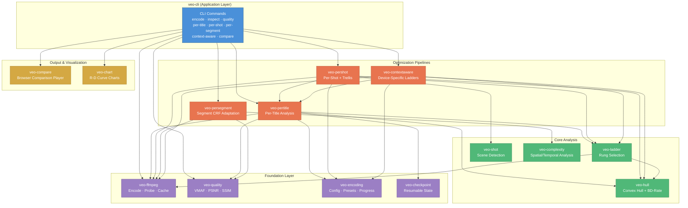
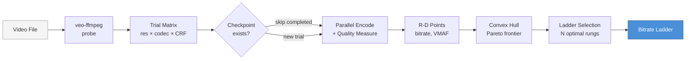
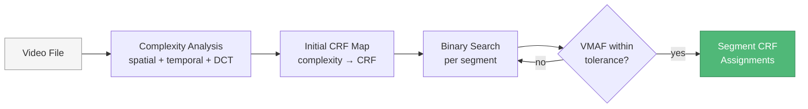
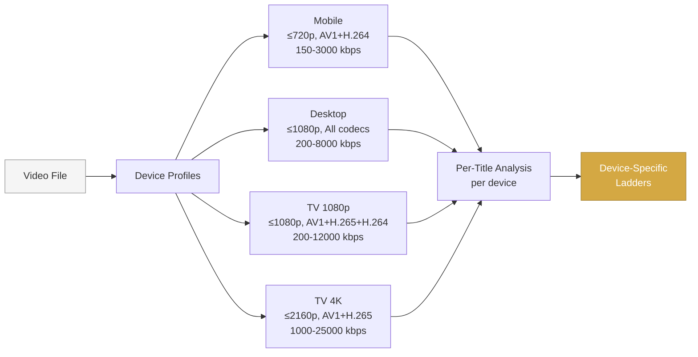
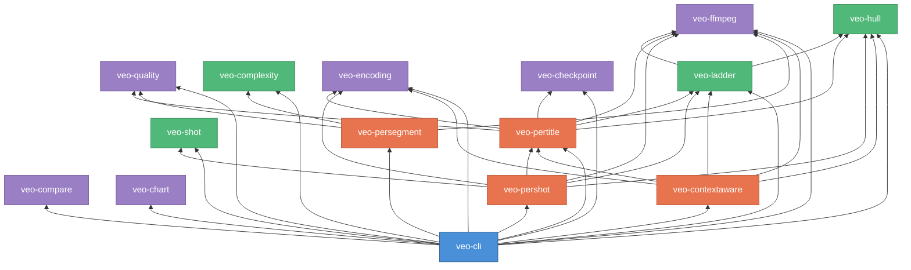

# VEO System Design

## Architecture Overview

## Data Flow: Per-Title Pipeline (Core)

## Data Flow: Per-Shot Pipeline

## Data Flow: Segment-Level Adaptation

## Data Flow: Context-Aware Encoding

## Crate Dependency Graph

## Key Design Decisions

| Decision | Rationale |
|----------|-----------|
| **VMAF as primary metric** | Perceptual quality correlates better with human perception than PSNR/SSIM |
| **Convex hull optimization** | Pareto-optimal R-D frontier eliminates dominated encoding points |
| **Trellis (Lagrangian) allocation** | Constant-slope bit distribution maximizes aggregate quality across shots |
| **Semaphore-gated parallelism** | Bounds concurrent encodes to `num_cpus/2` to avoid thrashing |
| **SHA256 checkpoint hashing** | Automatic invalidation when config changes; safe resume otherwise |
| **Codec-agnostic pipeline** | Same optimization framework works for H.264, H.265, and AV1 |
| **Layered crate architecture** | Each crate has single responsibility; pipelines compose foundation crates |
